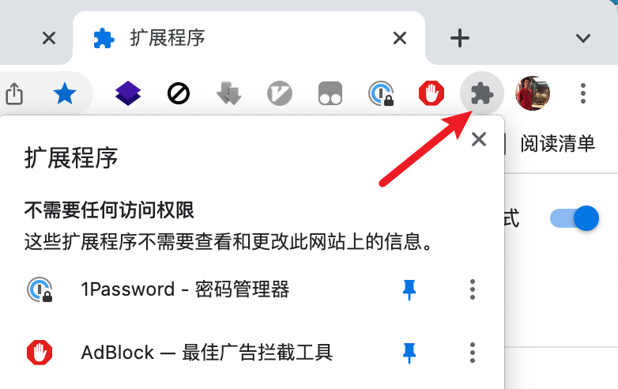
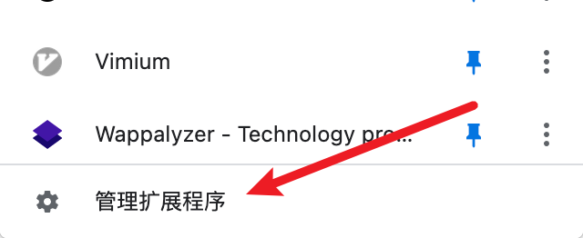
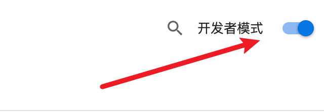
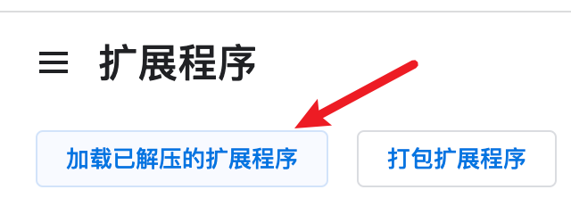
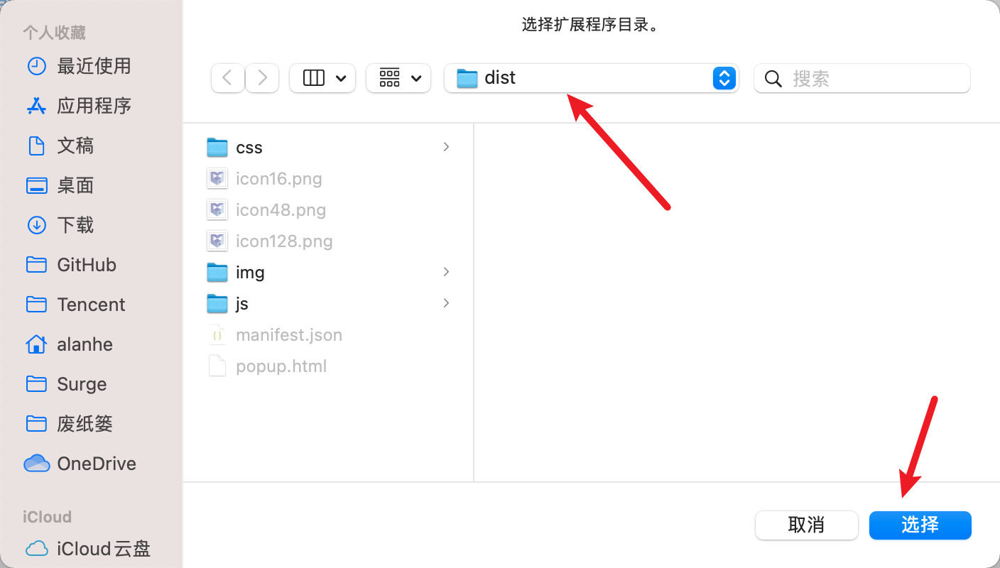

[TOC]

## 安装步骤-开发版

> 考虑到国内大多数受众，目前采用未打包版即开发版进行发布，用户需要下载插件压缩包，进行解压安装。

1. 下载插件Zip压缩包

2. 解压Zip压缩包

3. 打开Chrome浏览器，进入插件页面`chrome://extensions/`
   
   
4. 打开开发者模式，重启浏览器
   

5. 加载插件文件夹`/dist`
   
   

## dApp接入

完整例子，见`test/test-dapp.html`

### 判断插件是否安装

> 根据hasExtension来确定是否安装插件

```shell
var hasExtension = Boolean(chainMaker);
// 通过chainMaker.version也可以获取具体版本信息
```

### 接收插件发送消息

> 具体logic可根据message消息体进行判断处理。message类型定义，查看`src/event-page.ts/ExtensionResponse`

```javascript
  window.addEventListener("message", function (event) {
  if (event.source !== window || !event.data.data || !event.data.data.status) {
    return;
  }
  console.log(event.data)
}, false);
```

### 发送消息到插件

与判断插件是否安装方式一致，当前`支持安装合约/调用合约`，具体参数见`src/event-page.ts`

```shell
    const body = {
      contractName,
      contractVersion: 'v1.0.0',
      contractFile: await file2BinaryString(contractFile),
      runtimeType: 'WASMER',
      params: {}
    };
    window.chainMaker.createUserContract({
      body,
      ticket: Date.now().toString()
    })
```

## 代理使用

由于当前技术限制，插件钱包为了正常使用，会需要借助代理服务，目前插件内置了一套代理服务，如果想要更换，可以自行启动部署一套代理服务。

代理服务部署如下

```shell

# 启动代理服务，Nginx推荐版本为1.23.3

docker pull nginx:1.23.3

docker run --name "smartplugin-proxy" -p 9080:9080 -p 9081:9081 -d -v $(pwd)/deploy/nginx/conf.d/default.conf:/etc/nginx/nginx.conf:ro -v $(pwd)/deploy/nginx/log:/var/log/nginx -v $(pwd)/deploy/nginx/ssl:/var/www/ssl -v $(pwd)/deploy/nginx/njs:/etc/nginx/njs -v $(pwd)/deploy/nginx/cert:/etc/nginx/cert nginx:1.23.3

# 如果需要开机自动启动该容器服务，docker run时增加--restart=always，同时docker服务确保开机自启动
systemctl enable docker.service

# 删除代理服务
docker rm -f smartplugin-proxy

# 挂载目录权限设置
chmod -R 777 nginx/
```

## 常见问题

### 唯一确定一个事件一直收到的消息集

根据ExtensionResponse.ticket来确定。可以在发起安装合约/部署合约事件时记录事件ID，之后收到消息按照ticket来判断是否是该事件的回复信息。

### IDE下提示插件未安装

- 确定是否安装
- 网页注入chainMaker脚本需要时间，因此建议异步获取

## 相关文档

- 参考产品为[metamask](https://metamask.io/download.html)
- https://grpc.io/
- https://tea-design.github.io/component
- https://github.com/nuysoft/Mock/wiki/Getting-Started
- https://reactrouter.com/docs/en/v6/getting-started
- [长安链NodeSDK](https://docs.chainmaker.org.cn/v2.0.0/html/dev/SDK.html#nodejs-sdk)
- https://github.com/kjur/jsrsasign
