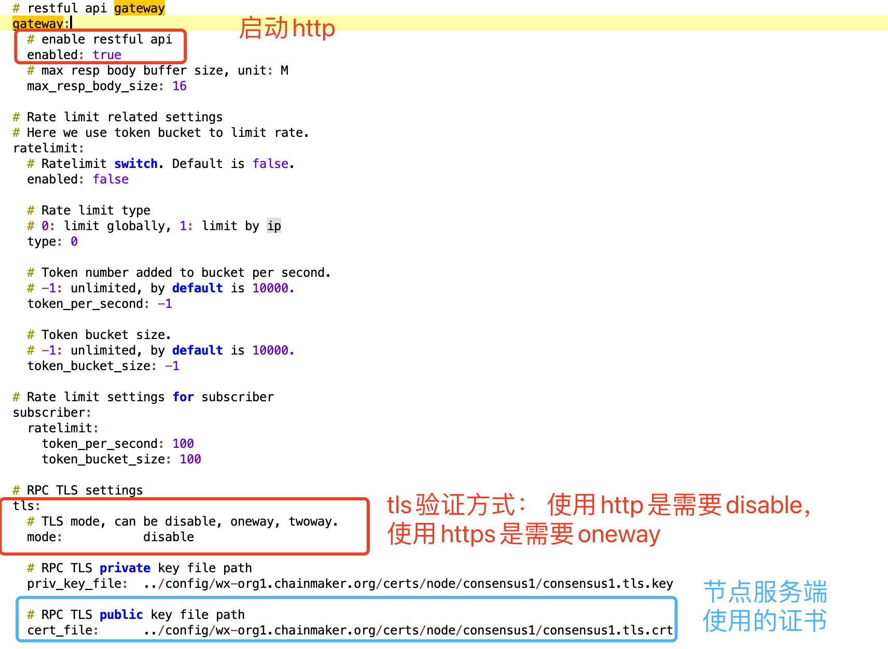
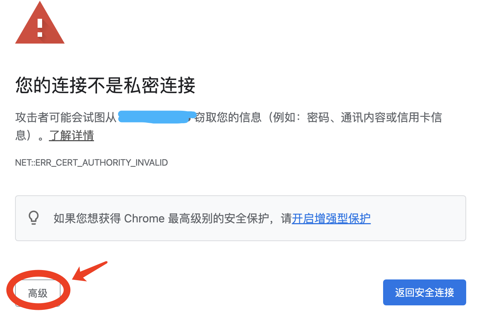
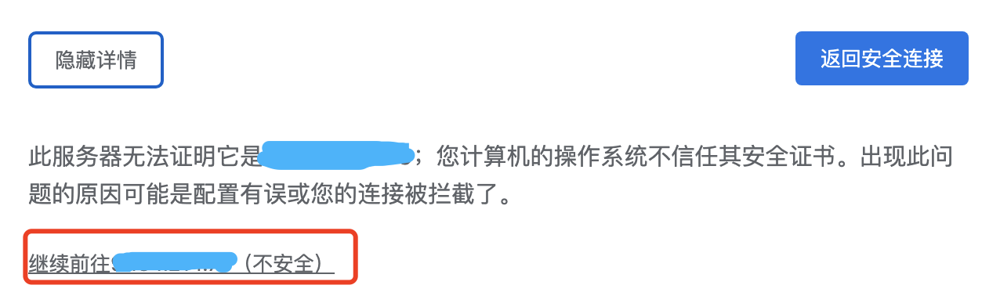
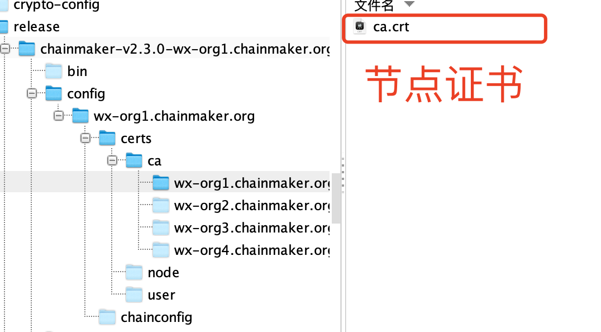
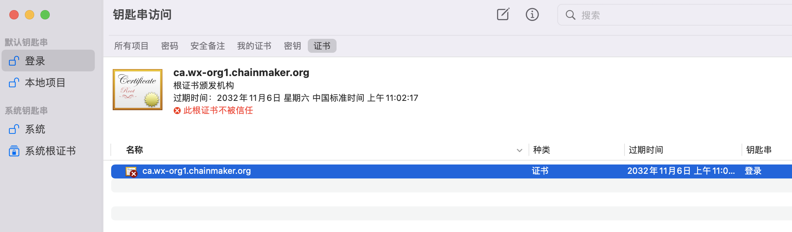
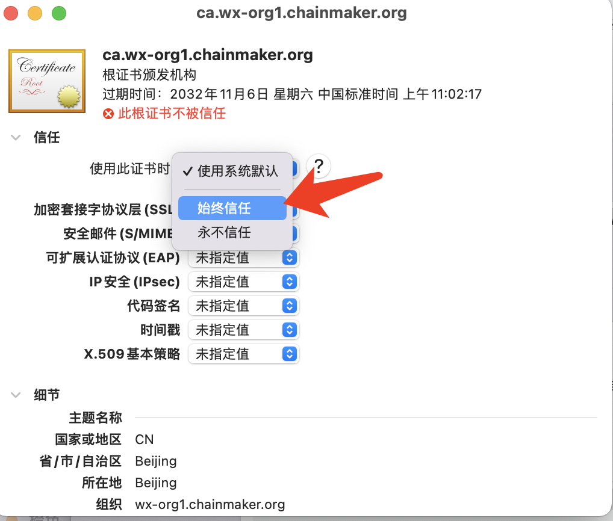
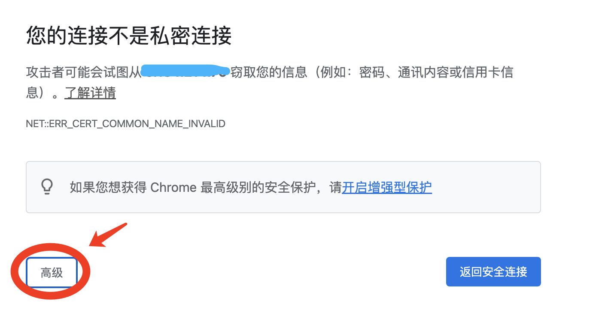
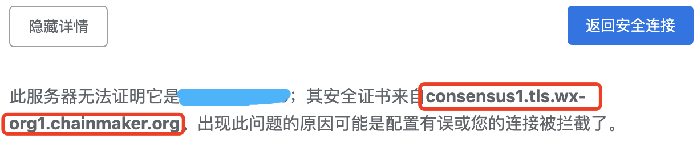

[TOC]

##  1. HTTP协议配置说明
### 1.1. 开启http链配置

> 链节点配置文件 `chainmaker.yml`， 默认路径如：`/chainmaker-go/build/release/chainmaker-v2.3.0-wx-org1.chainmaker.org/config/wx-org1.chainmaker.org/chainmaker.yml`

1. 开启网关配置：`enabled` 设置为 `true`

2. `[PermissionWithCert模式]` 修改tls验证方式：`tls.mode` 可根据需求进行设置
- 只支持http访问（禁用tls）： `disble`
- 使用https（tls单向验证）： `oneway`
- 使用grps（tls双向验证）： `twoway`

3. 如果在外网环境使用https时，建议将节点下的自签证书更换为机构颁发的证书； 开发时可以使用节点自签证书，但需要再客户端`授权允许访问自签证书https站点` 或者 `安装信任节点自签名证书`.

### 1.2. 授权允许访问自签证书https站点

1. 通过chrome浏览器访问链节点https接口，并授权允许访问：https://`链接节点地址`/v1/getversion

### 1.3. 安装信任节点自签名证书

> 下载证书文件

1. Windows:

> <a href="https://msdn.microsoft.com/zh-cn/library/cc750534.aspx" target="_blank">Installing a root certificate on Windows</a>
下载证书后，双击证书，根据指引安装证书。证书安装过程，要确保证书存储到受信任的根证书颁发机构下。

2. Mac根证书安装信任

> 双击ca证书通过钥匙串打开

> 在列表中双击证书打开证书详情，点击选择始终信任，然后关闭证书详情

3. 设置本地代理，将连接节点地址代理至证书域名

> 安装完证书，如果是通过ip访问链节点，则浏览器会提示`ERR_CERT_COMMON_NAME_INVALID` 需要使用本地代理将ip代理至证书指定的hostName. 可通过选项`高级`，查看具体信息找到 `hostname`

